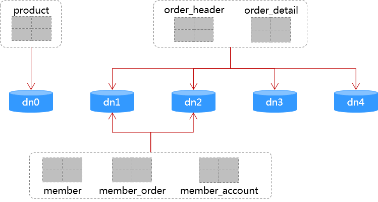

### MyCat管理
```sh
./mycat-server/bin/mycat start
./mycat-server/bin/mycat stop
./mycat-server/bin/mycat console
```
mycat启动之后，在Mac OSX环境通过mysql客户端连接mycat，需要指定protocol为TCP，否则即使指定了mycat的8066端口，在没有任何报错信息的情况下，连接的是3306上的mysql
```sh
mysql -h localhost -P 8066 -uroot -p --protocol=TCP
mysql -h localhost -P 9066 -uroot -p --protocol=TCP
```
登录mycat的账号密码，使用`server.xml`中`<user>`节点的配置。
登录mycat管理端口9066后，执行`show @@database;`显示`schema.xml`中的schema名称列表：
```
+-------------+
| DATABASE    |
+-------------+
| test_schema |
+-------------+
```
执行`show @@datasource;`显示所有datanode节点：
```
+----------+-----------+-------+-----------+------+------+--------+------+------+---------+-----------+------------+
| DATANODE | NAME      | TYPE  | HOST      | PORT | W/R  | ACTIVE | IDLE | SIZE | EXECUTE | READ_LOAD | WRITE_LOAD |
+----------+-----------+-------+-----------+------+------+--------+------+------+---------+-----------+------------+
| dn1      | localhost | mysql | localhost | 3306 | W    |      0 |    1 |   10 |      26 |         0 |          0 |
| dn0      | localhost | mysql | localhost | 3306 | W    |      0 |    1 |   10 |      26 |         0 |          0 |
| dn3      | 127.0.0.1 | mysql | 127.0.0.1 | 3306 | W    |      0 |    1 |   10 |      26 |         0 |          0 |
| dn2      | localhost | mysql | localhost | 3306 | W    |      0 |    1 |   10 |      26 |         0 |          0 |
| dn4      | 127.0.0.1 | mysql | 127.0.0.1 | 3306 | W    |      0 |    1 |   10 |      26 |         0 |          0 |
+----------+-----------+-------+-----------+------+------+--------+------+------+---------+-----------+------------+
```

### 表及分片规则
以简单的B2C电商系统作为演示应用，演示用逻辑表及分片规则方案如下：


逻辑表作用说明：
- `member_account`：会员账号`account`与会员ID `member_id`对应关系，主键为`account`，分片键为`account_hash`。<br />
   其它表通过`member_id`与会员表关联，整个系统以`member_id`存取会员数据，因此会员表`member`选择`member_id`作为分片键；<br />
   会员使用`account` + `password`登录为高频场景，因此添加`member_account`表，相当于由应用维护的一个索引。这个也进行水平拆分，使用`account`的hashcode作为分片键；<br />
   1. 会员注册时提供`account`值，由应用生成`member_id`值，除插入`member`表，同时插入`member_account`表，2个插入操作mycat都可以根据分片字段路由到对应的datanode；
   2. 会员登录，以及注册时判断账号`account`是否已经注册过，都先通过`member_account`表查询`member_id`值，这个查询可以使用分片键完成路由。随后所有会员数据访问都通过`member_id`存取`member`表，同样使用分片键完成路由；
- `member_order`：会员ID `member_id`与会员订单`order_id`对应关系，主键为`member_id` + `order_id`，分片键为`member_id`。<br />
   其作用同`member_account`，是应用维护的一个索引，用于会员查询自己的订单。

<span style="color:red;">演示应用展示的分库分表解决方案应该能覆盖B2C电商系统用户交互的大部分场景，对于后台管理功能需要采用另外的解决方案，例如会员管理、订单管理的列表页面，无法使用分片键执行查询。</span>

### Tips
1. 测试了mycat数据库方式的全局序列sequence（`order_detail.detail_id`），简单使用多线程单机验证，功能正常；
2. mycat的全局序列不太方便直接用于分片键，`insert`数据后，未找到有效获取本次生成的sequance值的方法；<br />
   演示应用中的`member_id`，可以使用mycat的全局序列，方案如下：
   1. 注册会员时，先`insert` `member_account`表，`insert`过程中使用mycat全局序列生成`member_id`值；
   2. 在`insert`的DAO方法上，可以使用mybatis的`selectKey`获取到本次生成的`member_id`值：
      ```java
      @Insert("insert into member_account(account, account_hash, member_id) values (#{account}, #{accountHash}, #{memberId})")
      @SelectKey(before=false, keyColumn="member_id", keyProperty="memberId", resultType=Long.class, statementType=StatementType.PREPARED
          , statement="select member_id from member where account=#{account} and account_hash=#{accountHash}")
      int createMemberAccount(MemberAccount ma);
      ```
   3. 使用`member_id`值插入`member`表；
3. mycat 2.0在开发中，参考[Mycat2](https://github.com/MyCATApache/Mycat2) <br />
   从新特性来看，结果集缓存、自动集群管理、支持负载均衡等主要特性，方向偏了，mycat应该朝彻底无状态化、为mycat server降压减负的方向上做到极致，负载均衡、集群管理、缓存等，完全交由外围管理。
4. 简单性能对比测试 <br />
   Mac book pro，单机测试，50并发线程，对相同的业务逻辑功能（用户使用手机号+密码注册会员）进行测试，TPS指被测试业务逻辑的每秒执行次数（包含`select from member_account` + `insert into member` + `insert into member_account`）：
   - mycat + mybatis，分片: TPS在2200上下波动；
   - mybatis，不分片: TPS在2600上下波动；
   - 纯JDBC，不分片: TPS在3400上下波动；<br />
   单机测试，mycat server的CPU占用对测试结果有一定影响。<br />
   受单机资源限制，测试结果TPS高低不反映数据库吞吐率，而是反映平均执行时间，TPS越高执行速度越快。从结果看，中间加一层mycat后性能有一定下降，但幅度不大，不及mybatis与原生JDBC之间的差异。
5. 分片方案：
   - 尽量建立一层虚拟分片到实际物理节点的映射，方便物理节点扩容；
   - 分片算法的选择，充分考虑扩容时的数据迁移尽量简单方便；
   - 分片算法的选择，充分考虑其对高并发插入时的热点问题、XA事物问题；
6. 不要依赖mycat的XA事物；
