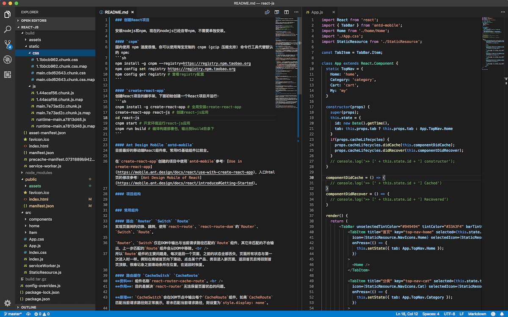

### 创建React项目

安装nodejs和npm，现在的nodejs已经自带npm，不需要单独安装。

#### 使用国内镜像 `cnpm`
国内使用 npm 速度很慢，你可以使用淘宝定制的 cnpm (gzip 压缩支持) 命令行工具代替默认的 npm:
```sh
npm install -g cnpm --registry=https://registry.npm.taobao.org
npm config set registry https://registry.npm.taobao.org
npm config get registry # 查看registry配置
```

#### React脚手架 `create-react-app`
创建React项目的脚手架，下面初始创建一个React项目并运行：
```sh
cnpm install -g create-react-app # 全局安装create-react-app
create-react-app react-js # 创建react-js应用
cd react-js
cnpm start # 开发环境运行react-js应用
cnpm run build # 编译构建部署包，输出到build目录下
```

#### Ant Design Mobile `antd-mobile`
目前最好的移动端React组件库，常用H5基础组件比较全。

在`create-react-app`创建的项目中使用`antd-mobile`参考：[Use in create-react-app](https://mobile.ant.design/docs/react/use-with-create-react-app)，入口html页的修改参考：[Ant Design Mobile of React](https://mobile.ant.design/docs/react/introduce#Getting-Started)。

#### 项目结构


`node_modules`：项目本地安装的模块都在这个目录下，项目源代码管理中需要忽略这个文件夹；<br />
`build/`：项目编译打包后的发布目录/部署包，项目源代码管理中可以忽略这个文件夹；<br />
`public/`：静态资源文件目录，里面的所有文件`build`后会都会拷贝到`build`目录中；<br />
`src/`：React JS的源代码目录，里面所有的JS、CSS样式文件，全部会被编译打包后输出到发布目录（`build/static/`中），编译后的文件如下：<br />
```sh
static/
   css/
      1.1bbcb962.chunk.css
      1.1bbcb962.chunk.css.map
      main.cbd62643.chunk.css
      main.cbd62643.chunk.css.map
   js/
      1.44acaf56.chunk.js
      1.44acaf56.chunk.js.map
      main.7e73ad2c.chunk.js
      main.7e73ad2c.chunk.js.map
      runtime~main.a7813d48.js
      runtime~main.a7813d48.js.map
```

#### 项目环境
本项目为了可以直接在github上访问，将React首页路径配置为了`https://liuzhibin-cn.github.io/research/react-js/build`。
1. `package.json`中设置`homepage`
   ```js
   "homepage": "https://liuzhibin-cn.github.io/research/react-js/build"
   ```
2. 在`public/index.html`中通过`%PUBLIC_URL%`引用这个配置
   ```html
   <script src="%PUBLIC_URL%/assets/js/fastclick-1.0.6.js"></script>
   document.writeln('<script src="%PUBLIC_URL%/assets/js/es6-promise.min-3.2.2.js"></script>');
   ```
3. 在`src/`下面的React组件中引用这个配置
   ```js
   const URL = process.env.PUBLIC_URL ? process.env.PUBLIC_URL : '';
   <Link key={item.id} to={`${URL}/item/${item.id}`}>
   ```

### 常用组件

#### 路由 `Router` `Switch` `Route`
实现页面间的切换、跳转，使用`react-route`、`react-route-dom`的`Router`、`Switch`、`Route`。

`Router`、`Switch`仅在DOM中输出与当前请求路径匹配的`Route`组件，其它未匹配的不会输出，上一步匹配的`Route`组件会从DOM中移除。<br />
所以`Route`组件的主要问题是，每次返回一个页面，之前的状态全部丢失，页面所有状态与第一次进入时一样。例如在商城首页向下滚动，点击某个产品、类目进入新页面，返回首页后将回到首页顶部，很难记录之前滚动条所在位置，在返回时恢复。

#### 路由缓存 `CacheSwitch` `CacheRoute`
**资料**：组件名称`react-router-cache-route`。<br />
**作用**：目的是解决`react-router`无法保留页面状态的问题。

**原理**：`CacheSwitch`会在DOM节点中输出每个`CacheRoute`组件，如果`CacheRoute`匹配当前请求路径则正常展示，若未匹配当前请求路径，则设置为`style.display: none`。

**问题**：单独使用(不与`AnimatedRouter`一起)时，如果`CacheRoute`下面的子组件包含定时任务更新`state`、`props`(主要是自动播放的动画效果，例如轮播图的自动播放等)，在`CacheRoute`由隐藏变为显示时（路由到新页面再返回），这些子组件区域变为空白，下一次自动刷新后才会显示出来。

#### 转场效果 `AnimatedRouter`
**资料**：组件名称

**作用**：在路由页面切换（包括进入新页面，返回原页面）时，模拟APP原生应用的转场效果：
- 进入新页面时：原页面从右向左slide out，新页面从右向左slide in；
- 返回原页面时：原页面从左向右slide in，新页面从左向右slide out；

**原理**：<br />
使用React官方提供的`react-transition-group`中的`TransitionGroup`、`CSSTransition`实现，`CSSTransition`提供了`onExit`、`onExited`、`onEnter`、`onEntered`、`transitionend`等事件，在这些事件中为子组件设置相应的css class，利用`translate3d`来实现转场效果。

**问题**：
1. `AnimatedRouter`与`CacheSwitch`结合使用后，`CacheSwitch`完全失效了。<br />
   不仅`CacheSwitch`失效，还会导致额外的`CacheRoute`组件创建行为。例如首页进入单品页的切换过程，会额外创建一个首页组件，从单品页返回首页时，仍然重新创建一个首页组件。<br />
   原因是`AnimatedRouter`或者`CSSTransition`操作了包裹元素的属性（应该是通过`props`），触发下面的子组件刷新行为，重新创建子组件对象，且貌似通过子组件的`getDerivedStateFromProps`、`shouldComponentUpdate`也无法阻止。
2. 还是`AnimatedRouter`与`CacheSwitch`结合使用问题，由于`CacheRoute`组件采用`style.display:none`方式隐藏，路由切换期间，本应该slide out的组件会突然消失不见，仅有新组件slide in；
3. 使用浏览器的前进后退按钮，转场效果正常；iPhone下从Safari左、右边缘开始滑动触发的前进后退，会出现2次转场效果。这点不确定单独使用`AnimatedRouter`是否也存在这个问题。

#### 平滑滚动 `Scrollbar`