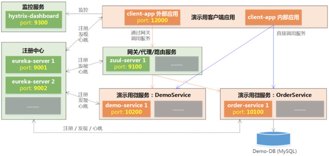

# 架构概况



# 启动演示项目

### 前期准备
本演示项目使用的开发环境：`Mac OSX`、`JDK 1.8`

从github下载演示项目代码：
```shell
git clone https://github.com/liuzhibin-cn/research.git ./
```

建立演示数据库：

1. 在`MySQL`数据库中使用`spring-cloud/order-service-impl/src/main/resources/db.sql`脚本建立演示数据库和表；
2. 修改`spring-cloud/order-service-impl/src/main/resources/application.yml`JDBC配置，包括`数据库名`、`账号`、`密码`；

进入`spring-cloud/order-service-client`目录，执行下面命令将`OrderService`客户端和服务端共享的jar包安装到本地maven仓库：
```shell
mvn install
```

### 启动Eureka注册中心
项目演示了使用2个erueka server建立高可用注册中心。<br />
进入`spring-cloud/eureka-server`目录，执行下面命令编译打包：
```shell
mvn package
```
启动第1个注册中心：
```shell
java -jar target/spring-cloud-eureka-server-0.0.1-SNAPSHOT.jar --spring.profiles.active=peer1
```
启动第2个注册中心：
```shell
java -jar target/spring-cloud-eureka-server-0.0.1-SNAPSHOT.jar --spring.profiles.active=peer2
```

*注意：2个注册中心通过互相注册同步复制的方式提供高可用性，在启动第1个注册中心时因为第2个注册中心还没有启动，因此会有一些报错信息，等第2个注册中心启动完成后就恢复正常了。*

### 启动其它服务
除了注册中心之外，演示项目中的其它所有服务和应用都通过下面maven命令启动：
```shell
mvn spring-boot:run
```
依次进入`demo-service`、`order-service-impl`、`zuul-server`、`client-app`、`hystrix-dashboard`目录，执行上述命令启动相关服务和应用。<br />
每次启动一个服务或应用，都必须新开一个shell终端、命令行窗口。

# 访问演示项目

**访问注册中心** <br />
通过[http://localhost:9001](http://localhost:9001)或者[http://localhost:9002](http://localhost:9002)访问注册中心，可以看到各服务和应用的注册状态：<br />


**直接访问服务** <br />
直接访问Demo服务：[http://localhost:10200/ping?msg=Ping](http://localhost:10200/ping?msg=Ping)，在浏览器可以看到服务返回消息，在Demo服务的启动窗口可以看到服务端的日志输出。<br />
直接访问Order服务：[http://localhost:10100/order/find?status=New](http://localhost:10100/order/find?status=New)，此时浏览器没有输出内容，因为我们还没有创建任何订单。

**访问客户端应用** <br />
浏览器打开[http://localhost:12000](http://localhost:12000)可以看到客户端功能演示用的全部URL清单。
```shell
http://localhost:12000/via-zuul/demo/ping?msg=Ping
http://localhost:12000/via-zuul/demo/benchmark
http://localhost:12000/via-zuul/order/create
http://localhost:12000/via-zuul/order/find?status=New
http://localhost:12000/via-zuul/order/get/1
http://localhost:12000/via-zuul/order/update/1?status=Close
http://localhost:12000/no-zuul/demo/ping?msg=Ping
http://localhost:12000/no-zuul/demo/benchmark
http://localhost:12000/no-zuul/order/create
http://localhost:12000/no-zuul/order/find?status=New
http://localhost:12000/no-zuul/order/get/1
http://localhost:12000/no-zuul/order/update/1?status=Close
```

# 参考

Spring Cloud构建微服务架构：[（一）服务注册与发现](http://blog.didispace.com/springcloud1/)、[（二）服务消费者](http://blog.didispace.com/springcloud2/)、[（三）断路器](http://blog.didispace.com/springcloud3/)、[（四）分布式配置中心](http://blog.didispace.com/springcloud4/)、[（四）分布式配置中心（续）](http://blog.didispace.com/springcloud4-2/)、[（五）服务网关](http://blog.didispace.com/springcloud5/)、[（六）高可用服务注册中心](http://blog.didispace.com/springcloud6/)、[（七）消息总线](http://blog.didispace.com/springcloud7/) <br />

[SpringBoot配置属性之MVC](https://segmentfault.com/a/1190000004315890)

[Spring Boot多数据源配置与使用](http://www.jianshu.com/p/34730e595a8c)