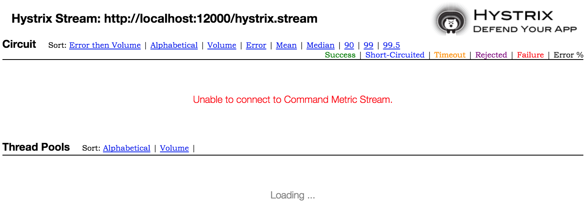

# 架构概况


* **Eureka Server: 注册中心** <br />
  `Spring Cloud Netflix`的微服务注册中心，提供服务注册、发现功能，主要工作机制如下：
  1. 服务启动时，通过`Eureka Client`将自己注册到`Eureka Server`。<br />
     主要注册信息包括主机名、端口号、服务名，这样，注册中心就维护了一份所有服务可用实例清单。
  2. 服务的客户端启动时，通过`Eureka Client`向注册中心获取服务实例清单，注册中心将被请求服务所有可用实例返回给该客户端。
  3. 客户端在本地缓存服务实例清单，每次调用服务方法时，使用`Ribbon`客户端负载均衡确定调用哪一个服务实例，直接与这个服务实例通讯。服务调用过程不经过注册中心。
  4. 每个服务实例启动之后，每30秒（默认）向注册中心发送一次心跳服务，证明自己仍然是可用状态。<br />
     如果注册中心在一定时间内没有收到某个服务实例的心跳信息，则注册中心会将该服务标记为不可用状态，并且会将该服务实例的状态同步给注册中心集群内的其它节点。
  5. 每个客户端实例启动后，同样每30秒（默认）向注册中心发送一次请求，获取最新的可用服务实例清单。<br />
     这样可以确保如果某个服务实例下线或者故障停机，每个客户端能够及时刷新这些状态，`Ribbon`客户端负载均衡时不会再将请求分配给已下线或停机的服务实例。
* **Zuul Server: 服务网关**
  服务网关主要作用是代理、路由，主要工作机制如下：
  1. 不使用服务网关时，服务的客户端使用服务名称直接调用服务；
  2. 使用服务网关后，服务的客户端将请求发送给Zuul网关服务，由网关服务网将调用请求路由给服务端，将请求执行结果返回给客户端；<br />
  
  Zuul服务在服务客户端和服务端之间加入了一个中间层，它不参与任何业务逻辑处理，只是在中间发挥路由转发作用。但是可以在Zuul服务上添加非业务逻辑控制，例如统一的安全认证、权限管理、性能和故障监控、流量管控等。<br />
  客户端在调用服务时，不再使用目标服务名称，而是使用Zuul服务名。对于客户端来说，Zuul服务就是服务提供者，无需关心其背后会路由给谁。这样，Zuul服务可以将大量的微服务整合起来，逻辑上形成一个大的服务，这对于某些任务，例如统一规范对外的REST服务路径等，比较方便。<br />
  另外，Zuul代理还可以用于将采用微服务架构开发的新应用，与未采用微服务架构的老应用集成起来。
  
* **Hystrix Dashboard: Hystrix监控仪表盘**
* **DemoService: 演示用微服务**
* **OrderService: 演示用微服务**

# 启动运行

### 前期准备
本演示项目使用的开发环境：`Mac OSX`、`JDK 1.8`

从github下载演示项目代码：
```shell
git clone https://github.com/liuzhibin-cn/research.git ./
```

建立演示数据库：

1. 在`MySQL`数据库中使用`spring-cloud/order-service-impl/src/main/resources/db.sql`脚本建立演示数据库和表；
2. 修改`spring-cloud/order-service-impl/src/main/resources/application.yml`JDBC配置，包括`数据库名`、`账号`、`密码`；

进入`spring-cloud/order-service-client`目录，执行下面命令将`OrderService`客户端和服务端共享的jar包安装到本地maven仓库：
```shell
mvn install
```

### 启动Eureka注册中心
项目演示了使用2个erueka server建立高可用注册中心。<br />
进入`spring-cloud/eureka-server`目录，执行下面命令编译打包：
```shell
mvn package
```
启动第1个注册中心：
```shell
java -jar target/spring-cloud-eureka-server-0.0.1-SNAPSHOT.jar --spring.profiles.active=peer1
```
启动第2个注册中心：
```shell
java -jar target/spring-cloud-eureka-server-0.0.1-SNAPSHOT.jar --spring.profiles.active=peer2
```

*注意：2个注册中心通过互相注册同步复制的方式提供高可用性，在启动第1个注册中心时因为第2个注册中心还没有启动，因此会有一些报错信息，等第2个注册中心启动完成后就恢复正常了。*

### 启动其它服务
除了注册中心之外，演示项目中的其它所有服务和应用都通过下面maven命令启动：
```shell
mvn spring-boot:run
```
依次进入`demo-service`、`order-service-impl`、`zuul-server`、`client-app`、`hystrix-dashboard`目录，执行上述命令启动相关服务和应用。<br />
每次启动一个服务或应用，都必须新开一个shell终端、命令行窗口。

# 功能演示

### 访问注册中心
通过[http://localhost:9001](http://localhost:9001)或者[http://localhost:9002](http://localhost:9002)访问注册中心，可以看到各服务和应用的注册状态：<br />


### 直接访问微服务
Demo服务：[http://localhost:10200/ping?msg=Ping](http://localhost:10200/ping?msg=Ping)。在浏览器可以看到服务返回消息，在Demo服务的启动窗口可以看到服务端的日志输出。<br />
Order服务：[http://localhost:10100/order/find?status=New](http://localhost:10100/order/find?status=New)，此时浏览器没有输出内容，因为我们还没有创建任何订单，后面创建好订单后再访问该地址，浏览器会以JSON格式输出查询结果。

### 访问客户端应用
浏览器打开[http://localhost:12000](http://localhost:12000)可以看到客户端功能演示用的全部URL清单。<br />
其中，URL包含`no-zuul`的，客户端应用直接调用微服务接口，不通过网关服务；URL包含`via-zuul`的，客户端通过网关服务调用微服务接口，即客户端应用以`HTTP REST`形式向`zuul`网关服务发送请求，网关服务根据规则将请求路由到Demo服务或Order服务（同样使用`HTTP REST`形式）。

1. `/demo/ping?msg=Ping`: 客户端应用向`DemoService`发送一个`Ping`消息（`msg=Ping`为发送的消息内容），`DemoService`返回一个`Pong`消息。
2. `/demo/benchmark`: 简单的性能测试。客户端应用分3轮调用`DemoService`的`ping`接口，每轮调用5000次，执行完成后在浏览器中显示平均执行时间。注意：该URL执行完毕需用时30-40秒左右。
3. `/order/create`: 客户端应用调用微服务`OrderService`的创建订单接口，随机创建一个订单。
4. `/order/find?status=New`: 客户端应用调用微服务`OrderService`的订单查询接口，返回指定状态的所有订单列表。可选的状态值为：`New`、`Confirmed`、`Shipped`、`Canceled`、`Closed`。
5. `/order/get/1`: 客户端应用调用微服务`OrderService`的订单获取接口，返回订单详情。URL最后一位数字为订单ID。
6. `/order/update/1?status=Close`: 客户端应用调用微服务`OrderService`的订单状态更新接口，通过URL指定订单ID和要更新的目标状态值。

# Hystrix Dashboard 监控服务
浏览器打开[http://localhost:9300/hystrix](http://localhost:9300/hystrix)，界面显示如下：<br />


-------------------------------------
在输入框中输入：`http://localhost:12000/hystrix.stream`，点击`Monitor Stream`按钮。<br />
如果是客户端应用刚启动，还未执行过任何请求，则界面显示如下（长时间处于Loading状态，或者报错无法连接上）：<br />


-------------------------------------
访问几次客户端应用的演示功能，刷新`Hystrix Dashboard`页面，则会显示监控内容。可以开启另外一个浏览器执行`benchmark`演示功能，观察`Hystrix Dashboard`的监控情况：<br />


# 参考

1. [Spring Cloud Netflix Reference](http://cloud.spring.io/spring-cloud-netflix/spring-cloud-netflix.html)
2. [Netflix Hystrix](https://github.com/Netflix/Hystrix)、[Netflix Hystrix Wiki](https://github.com/Netflix/Hystrix/wiki)
3. [Netflix Zuul](https://github.com/Netflix/zuul)、[Netflix Zuul Wiki](https://github.com/Netflix/zuul/wiki)
4. [Netflix Eureka Wiki](https://github.com/Netflix/eureka/wiki)
5. [Netflix Ribbon](https://github.com/Netflix/ribbon)、[Netflix Ribbon Wiki](https://github.com/Netflix/ribbon/wiki)
6. [实施微服务，我们需要哪些基础框架？](http://blog.csdn.net/neosmith/article/details/52118930)、[使用Spring Cloud Netflix技术栈实施微服务架构](http://blog.csdn.net/neosmith/article/details/52204113)
7. [Eureka! Why You Shouldn’t Use ZooKeeper for Service Discovery](https://tech.knewton.com/blog/2014/12/eureka-shouldnt-use-zookeeper-service-discovery/)、[为什么不要把ZooKeeper用于服务发现](http://www.infoq.com/cn/news/2014/12/zookeeper-service-finding/)
8. [Open-Source Service Discovery](http://jasonwilder.com/blog/2014/02/04/service-discovery-in-the-cloud/)、[开源的服务发现项目Zookeeper，Doozer，Etcd](http://blog.csdn.net/shlazww/article/details/38736511)
9. Spring Cloud构建微服务架构：[（一）服务注册与发现](http://blog.didispace.com/springcloud1/)、[（二）服务消费者](http://blog.didispace.com/springcloud2/)、[（三）断路器](http://blog.didispace.com/springcloud3/)、[（四）分布式配置中心](http://blog.didispace.com/springcloud4/)、[（四）分布式配置中心（续）](http://blog.didispace.com/springcloud4-2/)、[（五）服务网关](http://blog.didispace.com/springcloud5/)、[（六）高可用服务注册中心](http://blog.didispace.com/springcloud6/)、[（七）消息总线](http://blog.didispace.com/springcloud7/) 
10. [Spring Boot Profiles](http://docs.spring.io/spring-boot/docs/current/reference/html/boot-features-profiles.html)、[Spring Boot Profile-specific properties](http://docs.spring.io/spring-boot/docs/current/reference/html/boot-features-external-config.html#boot-features-external-config-profile-specific-properties)
11. [SpringBoot配置属性之MVC](https://segmentfault.com/a/1190000004315890) 
12. [Spring Boot多数据源配置与使用](http://www.jianshu.com/p/34730e595a8c)