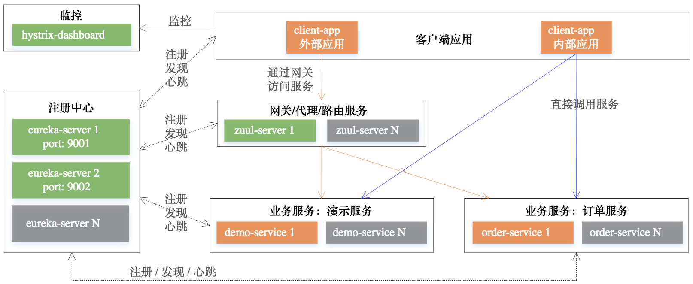

# 架构概况


图：Spring Cloud演示项目架构概况

# 运行演示

#### 前期准备
本演示项目使用的开发环境：`Mac OSX`、`JDK 1.8`

从github下载演示项目代码：
```shell
git clone https://github.com/liuzhibin-cn/research.git ./
```

建立演示数据库：<br />
1. 在`MySQL`数据库中使用`spring-cloud/order-service-impl/src/main/resources/db.sql`SQL脚本建立演示数据库和表；
2. 修改`spring-cloud/order-service-impl/src/main/resources/application.yml`中的JDBC信息，包括`数据库名`、`账号`、`密码`；

#### 启动注册中心
项目演示了使用2个erueka server建立高可用注册中心。<br />
进入`spring-cloud/eureka-server`目录，执行下面maven命令编译打包：
```shell
mvn package
```
启动第1个注册中心：
```shell
java -jar target/spring-cloud-eureka-server-0.0.1-SNAPSHOT.jar --spring.profiles.active=peer1
```
启动第2个注册中心：
```shell
java -jar target/spring-cloud-eureka-server-0.0.1-SNAPSHOT.jar --spring.profiles.active=peer2
```

*注意：2个注册中心通过互相注册同步复制的方式提供高可用性，在启动第1个注册中心时因为第2个注册中心还没有启动，因此会有一些报错信息，等第2个注册中心启动完成后就恢复正常了。*

#### 

# 参考

Spring Cloud构建微服务架构：[（一）服务注册与发现](http://blog.didispace.com/springcloud1/)、[（二）服务消费者](http://blog.didispace.com/springcloud2/)、[（三）断路器](http://blog.didispace.com/springcloud3/)、[（四）分布式配置中心](http://blog.didispace.com/springcloud4/)、[（四）分布式配置中心（续）](http://blog.didispace.com/springcloud4-2/)、[（五）服务网关](http://blog.didispace.com/springcloud5/)、[（六）高可用服务注册中心](http://blog.didispace.com/springcloud6/)、[（七）消息总线](http://blog.didispace.com/springcloud7/) <br />

[SpringBoot配置属性之MVC](https://segmentfault.com/a/1190000004315890)

[Spring Boot多数据源配置与使用](http://www.jianshu.com/p/34730e595a8c)